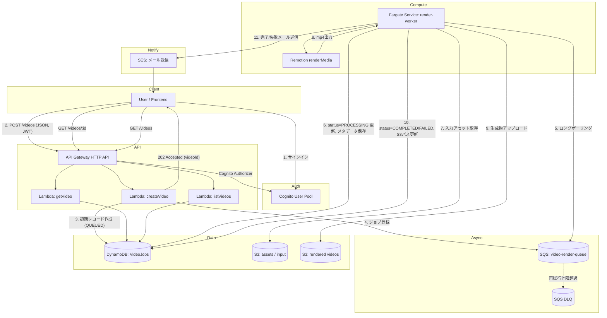

# アーキテクチャ設計: Remotion 動画生成ワークフロー

## 1. 概要

ユーザーが JSON で動画の内容(構成・テキスト・画像・音声などのパラメータ)を送信すると、
非同期に [Remotion](https://www.remotion.dev/) でレンダリングを行い、完了したらメールで通知する
サーバーレス〜コンテナのハイブリッド構成のワークフロー。

対応するユーザーフロー(要件):

```
ユーザが生成したい動画内容をJSONで入力
  ↓
キューに格納
  ↓
ワーカーがポーリングして、動画ID・メタデータ・ステータスなどをDBに保存
  ↓
動画生成を開始
  ↓
成功したら動画のパス・ステータスをDBに保存/更新
  ↓
メールで通知
```

## 2. 全体構成図



## 3. コンポーネント別の役割

| # | AWSサービス | 役割 |
|---|---|---|
| 1 | **Cognito** | ユーザー認証・認可。User Pool + App Client。API Gateway の JWT オーソライザーとして利用し、`sub`(ユーザーID)をリクエストに紐付ける。 |
| 2 | **API Gateway (HTTP API)** | `POST /videos`(動画生成リクエスト受付)、`GET /videos/{id}`(ステータス取得)、`GET /videos`(一覧取得)を公開。Cognito オーソライザーで保護。 |
| 3 | **Lambda** | 軽量・短時間で完結するAPIロジックを実行。入力JSONのバリデーション(zod)、DynamoDBへの初期レコード作成、SQSへのジョブ投入、ステータス参照。 |
| 4 | **SQS** | 動画生成ジョブのキュー。ワーカーの可用性・スケールに関わらずリクエストをバッファし、疎結合にする。DLQ(Dead Letter Queue)で規定回数以上失敗したメッセージを隔離。 |
| 5 | **Fargate (ECS)** | 常時稼働(または需要に応じてオートスケール)するワーカーコンテナ。Node.js プロセスが SQS を長時間ポーリングし、Chromiumベースの Remotion レンダリング(CPU/メモリ・実行時間ともにLambdaの制約に収まらないため、コンテナで実行)を行う。 |
| 6 | **DynamoDB** | 動画ジョブのステータス管理テーブル。`videoId` をパーティションキーに、ステータス(QUEUED/PROCESSING/COMPLETED/FAILED)・メタデータ・S3パス・エラー内容などを保持。`userId` の GSI でユーザー別一覧取得に対応。 |
| 7 | **S3** | 入力アセット(画像・音声など、必要な場合)と、レンダリング済み動画の格納先。バケット分離(または prefix 分離)。 |
| 8 | **SES** | 動画生成の成功/失敗をユーザーへメール通知。 |

## 4. データモデル (DynamoDB: `VideoJobs`)

| 属性 | 型 | 説明 |
|---|---|---|
| `videoId` (PK) | String (UUID) | 動画ジョブの一意なID |
| `userId` | String | Cognito `sub`。GSI `userId-createdAt-index` のPK |
| `status` | String | `QUEUED` \| `PROCESSING` \| `COMPLETED` \| `FAILED` |
| `input` | Map | ユーザーが指定した動画内容のJSON(タイトル・シーン・テキスト等) |
| `notifyEmail` | String | 通知先メールアドレス |
| `outputBucket` / `outputKey` | String | レンダリング済み動画のS3の場所(完了時) |
| `outputUrl` | String | 署名付きURL、または公開URL(完了時) |
| `errorMessage` | String | 失敗時のエラー内容 |
| `createdAt` / `updatedAt` | String (ISO8601) | 作成・更新日時 |

## 5. ジョブのライフサイクル

1. **受付 (API Lambda: `createVideo`)**
   - JWTから `userId` / `email` を取得。
   - リクエストボディを zod スキーマでバリデーション。
   - `videoId` (UUID) を発行し、DynamoDB に `status=QUEUED` の初期レコードを書き込む(即座にユーザーへステータスを返せるようにするための実装上の工夫。以降の更新は要件通りワーカー側が担当)。
   - SQS に `{ videoId }` のみを含む軽量メッセージを送信(ペイロード本体はDynamoDBから引く。SQSの256KB制限回避、DynamoDBを単一の真実源にするため)。
   - `202 Accepted` で `videoId` を返却。

2. **ポーリング〜処理開始 (Fargate Worker)**
   - `ReceiveMessage` (長時間ポーリング, `WaitTimeSeconds=20`) でメッセージを取得。
   - `videoId` を使い DynamoDB から `input` / `notifyEmail` を取得。
   - `status=PROCESSING`, `updatedAt` を更新。
   - Remotion (`@remotion/renderer` + `@remotion/bundler`) でレンダリングを実行。

3. **成功時**
   - 出力 mp4 を S3 にアップロード。
   - DynamoDB を `status=COMPLETED`, `outputBucket`, `outputKey` で更新。
   - SES で完了メールを送信。
   - SQS メッセージを削除。

4. **失敗時**
   - DynamoDB を `status=FAILED`, `errorMessage` で更新。
   - SES で失敗通知メールを送信。
   - メッセージを削除せず可視性タイムアウト経過後に再試行、最大受信回数超過でDLQへ移動。

## 6. スケーリング・信頼性の考慮

- **ワーカーの水平スケール**: Fargate Service を Application Auto Scaling で `ApproximateNumberOfMessagesVisible` (SQSのCloudWatchメトリクス) に基づきスケールさせる。
- **べき等性**: `videoId` をキーにした DynamoDB 更新は冪等。SQS の at-least-once 配信を考慮し、ワーカー側で「既に `COMPLETED`/`PROCESSING` なら重複実行を避ける」ガードを入れる。
- **可視性タイムアウト**: レンダリング時間を考慮し、SQSキューの可視性タイムアウトはワーカーの想定最大処理時間より十分長く設定(例: 15分)。長時間ジョブでは `ChangeMessageVisibility` で延長する実装も検討可能。
- **DLQ**: `maxReceiveCount` を超えたメッセージはDLQに送り、CloudWatch Alarmで運用者に通知。
- **コスト最適化**: Fargate はデフォルトの `desiredCount=1` の常時起動ワーカーとして実装しつつ、キュー滞留に応じてオートスケール(0台にはしない。0台にする場合はSQSトリガーでECS RunTaskを起動する設計に変更可能)。

## 7. Remotion コンポジション: `SimpleVideo`

シーン(テキスト・サブテキスト・背景画像/背景色)を順に並べたスライドショー形式の動画テンプレート。
シーン間の切り替えには [`@remotion/transitions`](https://www.remotion.dev/docs/transitions) の
`TransitionSeries` を使用しており、シーンごとに演出(`transitionType`)を指定できる。

| `transitionType` | 演出 | 方向指定 (`transitionDirection`) |
|---|---|---|
| `fade` (既定) | クロスフェード | なし |
| `slide` | 新シーンが指定方向からスライドイン | `from-left` / `from-right` / `from-top` / `from-bottom` |
| `wipe` | 指定方向からのワイプ | 同上 |
| `flip` | 指定方向への回転(3D風) | 同上 |
| `clockWipe` | 時計回りのワイプ | なし |
| `iris` | 中心から円形に広がるワイプ | なし |
| `none` | 演出なし(ハードカット) | なし |

- `transitionType`/`transitionDirection`/`transitionDurationInSeconds` はシーン単位で指定する
  (`packages/shared/src/schema.ts` の `VideoSceneSchema`)。先頭シーンの設定は無視される
  (前に切り替え元のシーンが存在しないため)。
- トランジション区間は前後シーンが時間的に重なる(クロスオーバーする)ため、動画の総尺は
  「各シーンの尺の合計 − トランジション尺の合計」になる。`packages/remotion-video/src/utils.ts`
  の `getTotalDurationInFrames` / `getTransitionDurationsInFrames` がこの計算を担い、
  トランジション尺が前後シーンの尺以上にならないよう自動的にクランプする。
- フロントエンドのシーン編集フォーム(`apps/web/src/components/SceneEditor.tsx`)から
  シーンごとに演出・方向・長さを選択できる。

### 背景画像アニメーション (Ken Burns)

背景画像 (`imageUrl`) を指定したシーンには、`imageAnimation` でゆっくりとしたズーム/パンの
アニメーション(いわゆる Ken Burns 効果)を付けられる。

| `imageAnimation` | 効果 |
|---|---|
| `none` (既定) | アニメーションなし(静止画のまま) |
| `zoomIn` | シーン開始から終了にかけて画像中心をゆっくり拡大 |
| `zoomOut` | 拡大した状態から徐々に等倍へ縮小 |
| `panLeftToRight` / `panRightToLeft` | 軽くズームした状態で視点を左右にゆっくり移動 |
| `panTopToBottom` / `panBottomToTop` | 同上、上下方向 |

- `imageAnimationIntensity` (0〜1, 既定0.15) でズーム/移動量の大きさを調整できる。
- 実装は `packages/remotion-video/src/kenBurns.ts` の `getImageAnimationTransform`。
  `object-fit: cover` で画面いっぱいに表示した画像にさらに `scale()` を掛けてはみ出し量(スラック)を作り、
  そのスラックの範囲内で `translate()` することでパン時も画像の端が見切れないようにしている。
  `transform: translate(px, py) scale(s)` の順にすることで `translate` の px/py 量が
  `scale` の影響を受けず、計算をシンプルにしている。
- イージングには `Easing.inOut(Easing.ease)` を用い、開始・終了が緩やかになるようにしている。

## 8. 今後の拡張候補

- CloudFront + S3 で生成済み動画を配信し、`outputUrl` をCDN経由の署名付きURLにする。
- Step Functions を挟んでレンダリングの前処理(音声合成・素材取得など)を複数ステップに分割する。
- WebSocket API (API Gateway) や SNS でリアルタイム進捗通知を追加する。
- 複数テンプレート(商品紹介/ニュース向けレイアウト等)、実写動画クリップ(`<Video>`)の合成、
  TTSによるナレーション自動生成。
