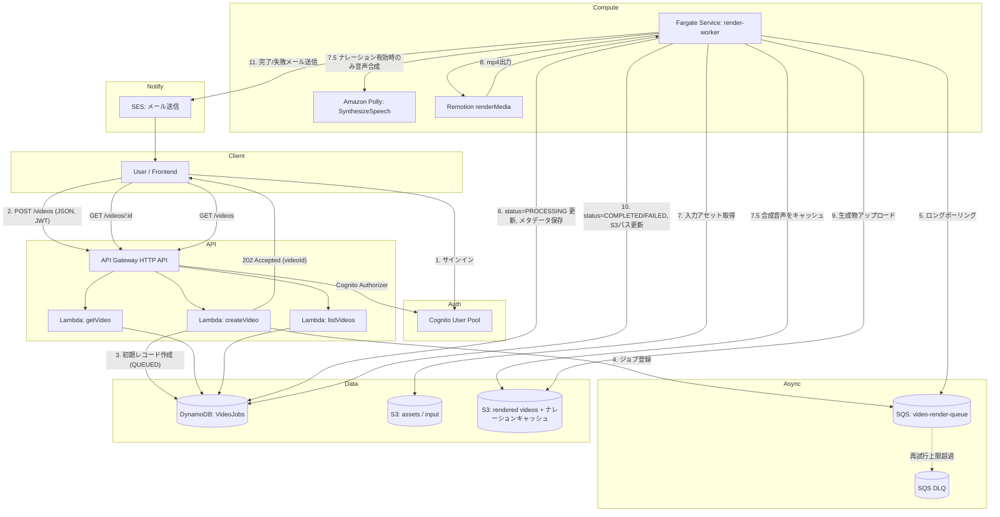

# アーキテクチャ設計: Remotion 動画生成ワークフロー

## 1. 概要

ユーザーが JSON で動画の内容(構成・テキスト・画像・音声などのパラメータ)を送信すると、
非同期に [Remotion](https://www.remotion.dev/) でレンダリングを行い、完了したらメールで通知する
サーバーレス〜コンテナのハイブリッド構成のワークフロー。

対応するユーザーフロー(要件):

```
ユーザが生成したい動画内容をJSONで入力
  ↓
キューに格納
  ↓
ワーカーがポーリングして、動画ID・メタデータ・ステータスなどをDBに保存
  ↓
動画生成を開始
  ↓
成功したら動画のパス・ステータスをDBに保存/更新
  ↓
メールで通知
```

## 2. 全体構成図



## 3. コンポーネント別の役割

| # | AWSサービス | 役割 |
|---|---|---|
| 1 | **Cognito** | ユーザー認証・認可。User Pool + App Client。API Gateway の JWT オーソライザーとして利用し、`sub`(ユーザーID)をリクエストに紐付ける。 |
| 2 | **API Gateway (HTTP API)** | `POST /videos`(動画生成リクエスト受付)、`GET /videos/{id}`(ステータス取得)、`GET /videos`(一覧取得)を公開。Cognito オーソライザーで保護。 |
| 3 | **Lambda** | 軽量・短時間で完結するAPIロジックを実行。入力JSONのバリデーション(zod)、DynamoDBへの初期レコード作成、SQSへのジョブ投入、ステータス参照。 |
| 4 | **SQS** | 動画生成ジョブのキュー。ワーカーの可用性・スケールに関わらずリクエストをバッファし、疎結合にする。DLQ(Dead Letter Queue)で規定回数以上失敗したメッセージを隔離。 |
| 5 | **Fargate (ECS)** | ワーカーコンテナ。Node.js プロセスが SQS を長時間ポーリングし、Chromiumベースの Remotion レンダリング(CPU/メモリ・実行時間ともにLambdaの制約に収まらないため、コンテナで実行)を行う。キューが空の間はタスク数0までスケールインし常時稼働コストをゼロにする(詳細は「6. スケーリング・信頼性の考慮」参照)。 |
| 6 | **DynamoDB** | 動画ジョブのステータス管理テーブル。`videoId` をパーティションキーに、ステータス(QUEUED/PROCESSING/COMPLETED/FAILED)・メタデータ・S3パス・エラー内容などを保持。`userId` の GSI でユーザー別一覧取得に対応。 |
| 7 | **S3** | 入力アセット(画像・音声など、必要な場合)、レンダリング済み動画、合成したナレーション音声のキャッシュ(`tts-cache/` prefix)の格納先。バケット分離(または prefix 分離)。 |
| 8 | **SES** | 動画生成の成功/失敗をユーザーへメール通知。 |
| 9 | **Amazon Polly** | ナレーション自動生成が有効な場合、シーンのテキストを音声合成する(`SynthesizeSpeech`)。ワーカー内から直接呼び出し、専用Lambda/マイクロサービスは追加していない。 |

## 4. データモデル (DynamoDB: `VideoJobs`)

| 属性 | 型 | 説明 |
|---|---|---|
| `videoId` (PK) | String (UUID) | 動画ジョブの一意なID |
| `userId` | String | Cognito `sub`。GSI `userId-createdAt-index` のPK |
| `status` | String | `QUEUED` \| `PROCESSING` \| `COMPLETED` \| `FAILED` |
| `input` | Map | ユーザーが指定した動画内容のJSON(タイトル・シーン・テキスト等) |
| `notifyEmail` | String | 通知先メールアドレス |
| `outputBucket` / `outputKey` | String | レンダリング済み動画のS3の場所(完了時) |
| `outputUrl` | String | 署名付きURL、または公開URL(完了時) |
| `errorMessage` | String | 失敗時のエラー内容 |
| `createdAt` / `updatedAt` | String (ISO8601) | 作成・更新日時 |

## 5. ジョブのライフサイクル

1. **受付 (API Lambda: `createVideo`)**
   - JWTから `userId` / `email` を取得。
   - リクエストボディを zod スキーマでバリデーション。
   - `videoId` (UUID) を発行し、DynamoDB に `status=QUEUED` の初期レコードを書き込む(即座にユーザーへステータスを返せるようにするための実装上の工夫。以降の更新は要件通りワーカー側が担当)。
   - SQS に `{ videoId }` のみを含む軽量メッセージを送信(ペイロード本体はDynamoDBから引く。SQSの256KB制限回避、DynamoDBを単一の真実源にするため)。
   - `202 Accepted` で `videoId` を返却。

2. **ポーリング〜処理開始 (Fargate Worker)**
   - `ReceiveMessage` (長時間ポーリング, `WaitTimeSeconds=20`) でメッセージを取得。
   - `videoId` を使い DynamoDB から `input` / `notifyEmail` を取得。
   - `status=PROCESSING`, `updatedAt` を更新。
   - `narration.enabled` が true の場合、Remotionレンダリングの前に Amazon Polly でシーンごとの
     ナレーション音声を合成し、`narrationAudioUrl`/`durationInSeconds` を確定させる
     (詳細は「ナレーション自動生成」セクション参照)。
   - Remotion (`@remotion/renderer` + `@remotion/bundler`) でレンダリングを実行。

3. **成功時**
   - 出力 mp4 を S3 にアップロード。
   - DynamoDB を `status=COMPLETED`, `outputBucket`, `outputKey` で更新。
   - SES で完了メールを送信。
   - SQS メッセージを削除。

4. **失敗時**
   - DynamoDB を `status=FAILED`, `errorMessage` で更新。
   - SES で失敗通知メールを送信。
   - メッセージを削除せず可視性タイムアウト経過後に再試行、最大受信回数超過でDLQへ移動。

## 6. スケーリング・信頼性の考慮

- **ワーカーの水平スケール**: Fargate Service を Application Auto Scaling でSQSの滞留メッセージ数に基づきスケールさせる(詳細は次項)。
- **べき等性**: `videoId` をキーにした DynamoDB 更新は冪等。SQS の at-least-once 配信を考慮し、ワーカー側で「既に `COMPLETED`/`PROCESSING` なら重複実行を避ける」ガードを入れる。
- **可視性タイムアウト**: レンダリング時間を考慮し、SQSキューの可視性タイムアウトはワーカーの想定最大処理時間より十分長く設定(例: 15分)。長時間ジョブでは `ChangeMessageVisibility` で延長する実装も検討可能。
- **DLQ**: `maxReceiveCount` を超えたメッセージはDLQに送り、CloudWatch Alarmで運用者に通知。

### Fargateのスケールtoゼロ (常時稼働コストの削減)

Fargateタスクを常時1台起動し続けるのではなく、**SQSにメッセージが無い間はタスク数を0にする**ことで
常時稼働コストをゼロにしている(`infra/lib/constructs/worker.ts`)。

- 使用するメトリクスは `ApproximateNumberOfMessagesVisible`(受信可能なメッセージ数)ではなく、
  処理中(受信済みだが未削除・可視性タイムアウト中)のメッセージも合算した
  **`ApproximateNumberOfMessagesVisible + ApproximateNumberOfMessagesNotVisible`**
  (SQS Queueの `metricApproximateNumberOfMessagesOutstanding`)を使う。
  `Visible` だけを見てしまうと、レンダリング中のメッセージは可視性タイムアウトの間カウントされなくなるため、
  **レンダリング中に誤ってタスクを0台にしてしまう恐れがある**。滞留数(処理中含む)が実際に0になったときのみ
  スケールインすることで、この事故を防いでいる。
- **スケールアウト**: 滞留数が1件以上になったら、CloudWatch Alarm(閾値1、1分間隔・1回で発報)をトリガーに
  Application Auto Scaling のステップスケーリングポリシーでタスク数を増やす
  (1〜9件で+1、10〜49件で+2、50件以上で+5)。0台からでも同じ仕組みで起動する。
- **スケールイン**: 滞留数が0件の状態が5分間連続したら、別のCloudWatch Alarm(閾値0以下、5分間連続)を
  トリガーにタスク数を**0に固定(ExactCapacity)**するポリシーを発火させる。突発的な一瞬の0件で
  縮退しすぎないよう、スケールアウト側より長い評価期間(5分)を設けている。
- オートスケーリングの `minCapacity` を0に設定することで、スケールインの下限を0台まで許可している。

### NATゲートウェイを使わないネットワーク構成 (固定費の削減)

VPCの主要な固定費であるNATゲートウェイ(時間課金 + データ処理課金)を使わず、以下の構成でコストを削減している。

- Fargateタスクは**パブリックサブネット**に配置し、`assignPublicIp: true` でパブリックIPを付与、
  インターネットゲートウェイ経由で直接アウトバウンド通信する(ユーザー指定の画像/動画URL取得、
  ECRからのコンテナイメージ取得、CloudWatch Logsへのログ送信、SES/Pollyの呼び出しなど)。
  タスクのセキュリティグループにはインバウンドルールを一切追加していないため、パブリックIPを
  持っていても外部から到達可能なポートは無い(アウトバウンドのみ許可)。
- DynamoDB・S3への通信は**Gateway VPCエンドポイント**(`vpc.addGatewayEndpoint`)経由にし、
  インターネットを経由せずAWSネットワーク内に閉じる。Gatewayエンドポイントは追加料金が発生せず、
  ルートテーブルに自動的に優先ルートが追加されるため、パブリックサブネットに配置していても
  DynamoDB・S3宛の通信はエンドポイント経由になる。
- NATゲートウェイが不要になったことで、VPCに用意するサブネットもパブリックサブネットのみでよく、
  未使用のプライベートサブネットを作らない構成にしている。

## 7. Remotion コンポジション: `VideoComposition`

Remotion のコンポジションは `VIDEO_COMPOSITION_ID` ("VideoComposition") の1つのみで、
`CreateVideoRequest.templateId` に応じてシーンの見た目(レイアウト)を切り替える構成になっている。
ワーカー (`apps/worker/src/infrastructure/remotion/RemotionVideoRenderer.ts`) は常にこの単一のコンポジションIDでレンダリングし、
どのテンプレートを描画するかは `inputProps.templateId` によって実行時に決まる
(コンポジションIDを切り替える必要はない)。

```
VideoComposition (packages/remotion-video/src/compositions/VideoComposition.tsx)
  - シーンの尺・トランジションの配線(TransitionSeries)を担当する共通基盤
  - templateId に応じて SCENE_TEMPLATES からテンプレートコンポーネントを選択し、
    各シーンの実際の描画(見出し・画像・バッジ等のレイアウト)を委譲する
      ├─ simple           -> SimpleTemplate.tsx (全画面 + 中央寄せテキスト)
      ├─ productShowcase  -> ProductShowcaseTemplate.tsx (左パネル + 右商品画像)
      └─ newsBulletin     -> NewsBulletinTemplate.tsx (全画面 + カテゴリバッジ + ロワーサード)
```

- `packages/remotion-video/src/Root.tsx` には本番と同じ `VIDEO_COMPOSITION_ID` に加え、
  Remotion Studio でテンプレートごとのプレビューを見やすくするための
  `VideoComposition-ProductShowcase` / `VideoComposition-NewsBulletin` / `VideoComposition-VideoClip` という
  プレビュー専用コンポジション(本番のレンダリングパスでは未使用)も登録している。
- 背景メディアの描画(`packages/remotion-video/src/components/SceneMedia.tsx`)、
  画像のKen Burnsアニメーション(`components/AnimatedImage.tsx`)、実写動画クリップの合成
  (`components/AnimatedVideo.tsx`)、シーン切り替えトランジション(`../transitions.ts`)はテンプレート
  非依存の共通ロジックとして切り出されており、どのテンプレートを選んでも利用できる。

### テンプレート一覧 (`templateId`)

| `templateId` | 用途 | レイアウト概要 |
|---|---|---|
| `simple` (既定) | 汎用スライドショー・お知らせ・名言カードなど | 全画面の画像/背景色の上に、中央寄せの見出し・説明文を重ねる |
| `productShowcase` | 商品紹介・広告 | 右55%に商品画像(Ken Burns対応)、左45%に見出し・説明・`badgeText`(価格/CTA)のパネル |
| `newsBulletin` | ニュース速報・お知らせ動画 | 全画面背景 + 左上の`badgeText`(カテゴリ/速報)バッジ + 下部ロワーサード(見出し・説明) + 右上に動画タイトルの透かし |

- `badgeText` (`VideoSceneSchema`) はテンプレートによって意味が変わる汎用の短いラベルフィールド
  (`productShowcase`では価格/CTA、`newsBulletin`ではカテゴリ/速報ラベルとして描画される。`simple`では未使用)。
- 新しいテンプレートを追加する場合は、`SceneTemplateComponent` を実装した
  コンポーネントを作成し、`VideoComposition.tsx` の `SCENE_TEMPLATES` に登録した上で
  `VideoTemplateId` (`packages/shared/src/schema.ts`) に選択肢を追加する。

### 実写動画クリップの合成 (`videoUrl`)

シーンの背景には静止画(`imageUrl`)だけでなく、`videoUrl` を指定して実写動画クリップ(mp4等)を
そのまま合成できる。両方指定された場合は `videoUrl` が優先され、`imageUrl`/Ken Burnsアニメーションは
無視される。

| フィールド | 説明 |
|---|---|
| `videoUrl` | 背景に合成する動画クリップのURL(S3の公開/署名付きURL、または http(s) URL) |
| `videoStartFromSeconds` (既定 0) | クリップの再生開始位置(秒)。一部だけをトリミングして使う場合に指定 |
| `videoVolume` (0〜1, 既定 0) | クリップ自体の音量。既定はミュートで、`audioUrl` のBGMと音が重ならないようにしている |

- 描画は `packages/remotion-video/src/components/SceneMedia.tsx` が担い、`videoUrl` があれば
  `AnimatedVideo.tsx`、無ければ `AnimatedImage.tsx`(画像/Ken Burns)、どちらも無ければ何も描画しない
  (`backgroundColor` がそのまま見える)、という優先順位で描画コンポーネントを切り替える。
  3つのテンプレート(`SimpleTemplate`/`ProductShowcaseTemplate`/`NewsBulletinTemplate`)は全て
  `SceneMedia` 経由で背景を描画するため、どのテンプレートでも画像/動画を同じように扱える。
- 動画クリップの描画には Remotion の `<Video>` ではなく `<OffthreadVideo>` を使用している。
  `<OffthreadVideo>` はサーバーサイドレンダリング時にffmpegで1フレームずつ正確に抽出するため、
  ブラウザの動画デコードタイミングに依存せず決定的なレンダリング結果になる
  (Remotion公式もレンダリング用途では `OffthreadVideo` を推奨している)。
- シーンの表示時間 (`durationInSeconds`) がクリップの残り尺(トリミング後)より長い場合、
  クリップは自然に終端で止まる(ループはしない)。ループ再生が必要な場合は将来の拡張候補とする。
- シーン切り替えトランジション(下記)は動画クリップの背景にもそのまま適用できる。

### シーン切り替えトランジション

シーン間の切り替えには [`@remotion/transitions`](https://www.remotion.dev/docs/transitions) の
`TransitionSeries` を使用しており、シーンごとに演出(`transitionType`)を指定できる。

| `transitionType` | 演出 | 方向指定 (`transitionDirection`) |
|---|---|---|
| `fade` (既定) | クロスフェード | なし |
| `slide` | 新シーンが指定方向からスライドイン | `from-left` / `from-right` / `from-top` / `from-bottom` |
| `wipe` | 指定方向からのワイプ | 同上 |
| `flip` | 指定方向への回転(3D風) | 同上 |
| `clockWipe` | 時計回りのワイプ | なし |
| `iris` | 中心から円形に広がるワイプ | なし |
| `none` | 演出なし(ハードカット) | なし |

- `transitionType`/`transitionDirection`/`transitionDurationInSeconds` はシーン単位で指定する
  (`packages/shared/src/schema.ts` の `VideoSceneSchema`)。先頭シーンの設定は無視される
  (前に切り替え元のシーンが存在しないため)。
- トランジション区間は前後シーンが時間的に重なる(クロスオーバーする)ため、動画の総尺は
  「各シーンの尺の合計 − トランジション尺の合計」になる。`packages/remotion-video/src/utils.ts`
  の `getTotalDurationInFrames` / `getTransitionDurationsInFrames` がこの計算を担い、
  トランジション尺が前後シーンの尺以上にならないよう自動的にクランプする。
- フロントエンドのシーン編集フォーム(`apps/web/src/components/SceneEditor.tsx`)から
  シーンごとに演出・方向・長さを選択できる。

### 背景画像アニメーション (Ken Burns)

背景画像 (`imageUrl`) を指定したシーンには、`imageAnimation` でゆっくりとしたズーム/パンの
アニメーション(いわゆる Ken Burns 効果)を付けられる。

| `imageAnimation` | 効果 |
|---|---|
| `none` (既定) | アニメーションなし(静止画のまま) |
| `zoomIn` | シーン開始から終了にかけて画像中心をゆっくり拡大 |
| `zoomOut` | 拡大した状態から徐々に等倍へ縮小 |
| `panLeftToRight` / `panRightToLeft` | 軽くズームした状態で視点を左右にゆっくり移動 |
| `panTopToBottom` / `panBottomToTop` | 同上、上下方向 |

- `imageAnimationIntensity` (0〜1, 既定0.15) でズーム/移動量の大きさを調整できる。
- 実装は `packages/remotion-video/src/kenBurns.ts` の `getImageAnimationTransform`。
  `object-fit: cover` で画面いっぱいに表示した画像にさらに `scale()` を掛けてはみ出し量(スラック)を作り、
  そのスラックの範囲内で `translate()` することでパン時も画像の端が見切れないようにしている。
  `transform: translate(px, py) scale(s)` の順にすることで `translate` の px/py 量が
  `scale` の影響を受けず、計算をシンプルにしている。
- イージングには `Easing.inOut(Easing.ease)` を用い、開始・終了が緩やかになるようにしている。

### ナレーション自動生成 (Amazon Polly)

`CreateVideoRequest.narration.enabled` を true にすると、ワーカーがレンダリング前処理として
Amazon Polly でシーンごとのナレーション音声を自動合成する。ニュース動画・ショート動画のように
テキストを読み上げたい用途を想定した機能で、既定では無効(コストが発生するため明示的なオプトイン)。

| フィールド | 説明 |
|---|---|
| `narration.enabled` (既定 false) | ナレーション自動生成の有効/無効 |
| `narration.engine` (既定 `standard`) | Pollyの合成エンジン。`standard`(低コスト)/`neural`(高品質・約4倍のコスト) |
| `narration.voiceId` (既定 `Takumi`) | 読み上げ音声。engineごとに選べる音声が異なる(`NARRATION_VOICES_BY_ENGINE`) |
| `scene.narrationText` (任意) | このシーンで読み上げるテキストを個別に指定。未指定なら `text` + `subtext` を結合して読み上げる |
| `scene.narrationSkip` (既定 false) | このシーンだけナレーションを無効化する |
| `scene.narrationAudioUrl` (通常は自動設定) | 合成済みナレーション音声のURL。ワーカーの前処理で設定される計算済みフィールド |

**処理フロー (`apps/worker/src/application/usecases/ApplyNarrationUseCase.ts`)**:

1. `narration.enabled` が false ならワーカーは何もせず、Pollyは一切呼び出されない。
2. 各シーンについて `resolveNarrationText` で読み上げテキストを決定する
   (`narrationSkip` なら対象外、`narrationText` があれば優先、無ければ `text`+`subtext` を結合)。
3. `(テキスト, engine, voiceId)` のハッシュを鍵に `s3://<outputBucket>/tts-cache/<engine>/<voiceId>/<hash>.mp3`
   をS3で検索し、存在すれば **Pollyを呼び出さずに再利用する**(同じ文言・設定の重複合成を避けコストを削減)。
4. キャッシュミス時のみ `Polly.SynthesizeSpeech` を呼び出し、結果をS3にキャッシュとして保存する。
5. `ffprobe` で合成した音声ファイルの実際の再生時間を取得する(Pollyの Speech Marks
   APIは別課金のため使用しない)。シーンの `durationInSeconds` がこの再生時間より短ければ、
   ナレーションが途切れないよう自動的に延長する(余白0.3秒を加算)。
6. S3の署名付きURLを `scene.narrationAudioUrl` に設定し、Remotionへの `inputProps` として渡す。
7. 個々のシーンの合成に失敗しても例外を投げず、そのシーンをナレーションなしで処理を継続する
   (ジョブ全体を失敗させて Fargate の再実行コストを発生させないため)。

**Remotion側の再生 (`packages/remotion-video/src/components/SceneNarration.tsx`)**:

- `scene.narrationAudioUrl` があれば `<Audio src={...} />` をシーンの `TransitionSeries.Sequence`
  内に配置するだけで、シーンの開始と同時に自動的に再生される。Remotionコンポジション自体は
  AWS SDKを一切呼び出さず、ワーカーが確定させた音声URLを再生するだけである。
- `audioUrl` (BGM) がある場合、いずれかのシーンにナレーションがあれば BGM音量を自動的に
  下げる簡易ダッキング(`VideoComposition.tsx` の `BGM_VOLUME_WITH_NARRATION`, 既定0.3倍)を行う。

**コスト最小化の設計判断**:

- 既定エンジンは最安の `standard`(100万文字あたり$4.00、`neural` は$16.00で4倍)。
- S3キャッシュにより同一テキスト・設定の重複合成を防ぐ。
- Speech Marks(発話タイミング情報)は別課金のため使用せず、`ffprobe` で無料に尺を取得する。
- 同期API (`SynthesizeSpeech`) のみを使用(1シーンの最大文字数560文字は同期APIの上限3,000文字を
  大きく下回るため非同期ジョブ化は不要)。
- 専用Lambda/マイクロサービスを追加せず、既存のFargateワーカー内で完結させている
  (追加のインフラ・IAMロールはPollyの呼び出し権限のみ)。
- 詳細な検討過程は [`docs/tts-narration-plan.md`](./tts-narration-plan.md) を参照。

## 8. ワーカーの内部構成 (クリーンアーキテクチャ)

`apps/worker` は、AWS特有の実装詳細をビジネスロジックから切り離すため、
クリーンアーキテクチャ(ヘキサゴナルアーキテクチャ)の考え方に沿って以下の3層に分割している。
**エンティティ・ユースケース・ポートはAWS SDKに一切依存しない** ことを構造的に保証している。

```
apps/worker/src/
  domain/                  # エンティティ層 (AWS非依存)
    entities/
      VideoJob.ts            - ジョブの状態判定などのドメインルール
      RenderedVideo.ts        - レンダリング済み動画の保存先を表す値オブジェクト
      NarrationRequest.ts     - 読み上げテキスト決定・キャッシュキー生成の純粋関数

  application/             # ユースケース層・ポート層 (AWS非依存)
    ports/                   - インターフェースのみを定義 (実装はinfrastructure層が持つ)
      JobRepository.ts / JobQueue.ts / VideoRenderer.ts / VideoStorage.ts /
      NotificationService.ts / SpeechSynthesizer.ts / AudioCache.ts / AudioDurationProbe.ts
    usecases/
      ProcessVideoJobUseCase.ts    - 1ジョブ分の処理フロー全体を統括
      ApplyNarrationUseCase.ts     - ナレーション合成(ポート経由でPolly/S3相当を利用)
      PollAndProcessJobsUseCase.ts - キューのポーリング〜メッセージ削除までを統括

  infrastructure/          # アダプター層 (AWS/外部コマンドに依存するのはここだけ)
    config.ts                - 環境変数の読み取り
    aws/
      awsClients.ts             - AWS SDKクライアントの生成
      DynamoDbJobRepository.ts  - JobRepository の DynamoDB実装
      SqsJobQueue.ts            - JobQueue の SQS実装
      S3VideoStorage.ts         - VideoStorage の S3実装
      S3AudioCache.ts           - AudioCache の S3実装 (ナレーションキャッシュ)
      SesNotificationService.ts - NotificationService の SES実装
      PollySpeechSynthesizer.ts - SpeechSynthesizer の Amazon Polly実装
    remotion/
      RemotionVideoRenderer.ts  - VideoRenderer の Remotion実装
    system/
      FfprobeAudioDurationProbe.ts - AudioDurationProbe の ffprobe実装

  index.ts                 # Composition Root: 上記アダプターを生成しユースケースに注入する。
                            # SQSポーリングループ・シグナルハンドリングなど、プロセスの
                            # ライフサイクル管理もここに置く(ビジネスロジックではないため)。
```

**設計方針**:

- `domain`/`application` から `infrastructure` への依存は禁止(依存の方向は常に外側→内側)。
  `application/ports/*` はインターフェースのみを定義し、`infrastructure/*` がそれを実装する
  (依存性逆転の原則)。`@video-generation/shared` のZodスキーマ由来の型(`CreateVideoRequest`
  等)はAWSは元よりいかなるフレームワークにも依存しないため、そのままエンティティとして扱える。
- **AWS認証情報が無い環境でもユニットテストが実行できる**ことが最大のメリット。
  `ApplyNarrationUseCase.test.ts` / `ProcessVideoJobUseCase.test.ts` は、
  ポートのインメモリ偽実装(Fake)だけを用意すれば、DynamoDB/S3/SES/Polly/Remotionの
  いずれもモック不要で成功系・失敗系・重複防止などのフローを検証できる。
- `index.ts` (Composition Root) だけが「どのアダプターを使うか」を知っている。
  将来ストレージやキューを別サービスに置き換える場合も、対応するアダプターを追加して
  `index.ts` の組み立てを差し替えるだけでよく、ユースケース側の変更は不要。
- ロギング(`console.*`)やNode標準の `fs`/`crypto` はAWS依存ではないため、
  簡潔さを優先しユースケース層から直接利用している(ポート化していない)。

## 9. 今後の拡張候補

- CloudFront + S3 で生成済み動画を配信し、`outputUrl` をCDN経由の署名付きURLにする。
- Step Functions を挟んでレンダリングの前処理(音声合成・素材取得など)を複数ステップに分割する。
- WebSocket API (API Gateway) や SNS でリアルタイム進捗通知を追加する。
- 動画クリップのループ再生対応(クリップ尺 < シーン尺の場合)、再生速度(`playbackRate`)調整、
  グラフ/データビジュアライゼーション、ロゴ/ウォーターマークのアップロード対応など、
  テンプレートで使える表現の拡充。
- ナレーションの `neural`/`generative` エンジンへの動的アップグレード提案、SSMLタグ(間・抑揚調整)対応、
  多言語対応(現状は日本語 `ja-JP` 固定)。
