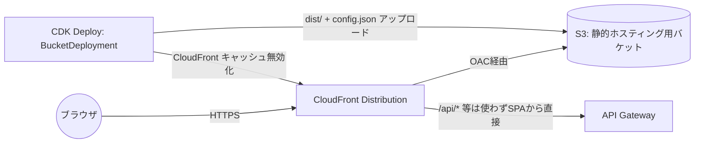

# フロントエンド実装計画

React (SPA) + S3 + CloudFront による静的ホスティング構成のフロントエンド実装計画です。
バックエンド(`docs/architecture.md`)で構築済みの API Gateway / Cognito / Lambda を利用します。

## 1. 要件・前提

- フレームワーク: **React**(SPA)
- ホスティング: **S3(静的アセット配置) + CloudFront(配信・HTTPS・キャッシュ)**
- 認証: 既存の Cognito User Pool / User Pool Client(`infra/lib/constructs/auth.ts`)をそのまま利用
- API: 既存の HTTP API(`POST /videos`, `GET /videos`, `GET /videos/{videoId}`)をそのまま利用
- サーバーサイドレンダリングは不要(完全な静的サイト + クライアントサイドAPI呼び出し)

## 2. 技術スタック

| 領域 | 採用技術 | 理由 |
|---|---|---|
| ビルドツール | Vite + React + TypeScript | 高速ビルド、S3への静的配置に適したSPA出力(`vite build` → `dist/`) |
| ルーティング | React Router v6 (`createBrowserRouter`) | SPAのクライアントサイドルーティング標準 |
| データ取得/キャッシュ | TanStack Query (`@tanstack/react-query`) | API呼び出し・キャッシュ・**ステータスのポーリング**(`refetchInterval`)に最適 |
| フォーム | React Hook Form + `@hookform/resolvers/zod` | 既存の `CreateVideoRequestSchema`(`@video-generation/shared`)をそのままバリデーションに再利用できる |
| 認証 | `amazon-cognito-identity-js` | 既存Cognito ClientがHosted UIなしの `USER_SRP_AUTH` 構成のため、SDK直呼びでカスタムログインUIを実装 |
| スタイリング | Tailwind CSS | 実装速度・保守性 |
| 型共有 | `@video-generation/shared` (workspace参照) | リクエスト/レスポンス型・zodスキーマをバックエンドと共有し、二重定義を避ける |

npm workspaces のモノレポにそのまま `apps/web` として追加します。

## 3. 画面構成

```mermaid
flowchart LR
    Login[/login\nログイン] --> Dashboard
    SignUp[/signup\nサインアップ+確認コード] --> Login
    Dashboard[/ (ProtectedRoute)\n動画一覧] --> NewVideo[/videos/new\n動画生成フォーム]
    Dashboard --> Detail[/videos/:videoId\nステータス詳細]
    NewVideo -- 送信後 --> Detail
```

| ルート | 画面 | 主な機能 |
|---|---|---|
| `/login` | ログイン | メール/パスワードでCognito認証(USER_SRP_AUTH) |
| `/signup` | サインアップ | ユーザー登録 + 確認コード(SignUp/ConfirmSignUp) |
| `/`(要ログイン) | ダッシュボード | `GET /videos` で自分のジョブ一覧をページング表示、ステータスバッジ表示 |
| `/videos/new`(要ログイン) | 動画生成フォーム | タイトル・シーン(テキスト/画像URL/背景色/秒数)を動的に追加・削除、`POST /videos` 送信 |
| `/videos/:videoId`(要ログイン) | 動画詳細 | ステータスを**ポーリング**して自動更新、`COMPLETED`時はダウンロードリンク(署名付きURL)、`FAILED`時はエラー内容表示 |

## 4. ディレクトリ構成(案)

```
apps/web/
├── package.json
├── vite.config.ts
├── tsconfig.json
├── index.html
├── public/
│   └── config.json            # ローカル開発用のダミー設定(本番はデプロイ時に生成・上書き)
└── src/
    ├── main.tsx                # エントリーポイント。runtimeConfigロード→ReactDOM.render
    ├── App.tsx                 # ルーター定義
    ├── routes/
    │   ├── LoginPage.tsx
    │   ├── SignUpPage.tsx
    │   ├── DashboardPage.tsx
    │   ├── NewVideoPage.tsx
    │   └── VideoDetailPage.tsx
    ├── components/
    │   ├── ProtectedRoute.tsx
    │   ├── SceneEditor.tsx      # シーンの追加/削除/並べ替えUI
    │   ├── VideoStatusBadge.tsx
    │   └── VideoList.tsx
    ├── lib/
    │   ├── runtimeConfig.ts    # /config.json を起動時に取得
    │   ├── cognitoAuth.ts      # amazon-cognito-identity-js のラッパー
    │   ├── apiClient.ts        # fetch + Authorizationヘッダー付与 + 401時リフレッシュ
    │   └── queryClient.ts      # TanStack QueryClient設定
    └── hooks/
        ├── useAuth.ts
        ├── useVideoList.ts
        ├── useVideoDetail.ts   # refetchIntervalでポーリング
        └── useCreateVideo.ts
```

## 5. ランタイム設定の注入方式(重要)

CloudFront+S3の静的ビルドは「1回ビルドしたものを複数環境(dev/stg/prod)へそのまま配置したい」ことが多いため、
`API URL` や `Cognito User Pool ID` を **ビルド時埋め込み(`import.meta.env`)ではなく実行時に取得** する方式にします。

- デプロイ時、CDKがスタックの出力(`ApiUrl`, `UserPoolId`, `UserPoolClientId`, `region`)から `config.json` を生成し、
  `dist/` と一緒にS3へアップロードします(`BucketDeployment` の `Source.jsonData`)。
- フロントエンドは起動時に `fetch('/config.json')` を行い、値をメモリに保持してからアプリを初期化します。

```json
// config.json (デプロイ時に自動生成される例)
{
  "apiUrl": "https://xxxxxxxxxx.execute-api.ap-northeast-1.amazonaws.com",
  "userPoolId": "ap-northeast-1_xxxxxxxxx",
  "userPoolClientId": "xxxxxxxxxxxxxxxxxxxxxxxxxx",
  "region": "ap-northeast-1"
}
```

これによりビルド成果物(`dist/`)は環境非依存になり、環境ごとの再ビルドが不要になります。

## 6. 認証フロー

1. ログインフォームで `amazon-cognito-identity-js` の `CognitoUser.authenticateUser()`(`USER_SRP_AUTH`)を実行
2. 成功時に IDトークン・アクセストークン・リフレッシュトークンを取得
   - API Gateway の `HttpJwtAuthorizer` は IDトークンの `sub`/`email` クレームを参照する実装(`apps/api/src/lib/auth.ts`)のため、**APIには IDトークンを付与**する
3. トークンは `sessionStorage`(タブを閉じたら破棄、XSSリスク低減のためlocalStorageより優先)に保存
4. `apiClient` は `fetch` のラッパーで、リクエスト毎に `Authorization: <idToken>` を付与
5. トークン期限切れ(401 or 有効期限切れ検知)時は `CognitoUser.refreshSession()` でリフレッシュトークンから再取得し、リトライ
6. サインアップは `CognitoUser` の `signUp` → メール確認コード入力 → `confirmRegistration` の2ステップ

Hosted UI やソーシャルログインは使わず、既存の User Pool Client 設定(`generateSecret: false`, `userSrp: true`)にそのまま乗せられる構成です。

## 7. API連携・データ取得設計

TanStack Query を用いて以下のように実装します。

| フック | 対応API | キャッシュ/更新方針 |
|---|---|---|
| `useVideoList` | `GET /videos?limit=&cursor=` | `useInfiniteQuery` でページング取得 |
| `useVideoDetail(videoId)` | `GET /videos/{videoId}` | `status` が `QUEUED`/`PROCESSING` の間は `refetchInterval: 3000` でポーリングし、`COMPLETED`/`FAILED` になったら自動停止 |
| `useCreateVideo` | `POST /videos` | `useMutation`。成功時に `videoId` を受け取り `/videos/:videoId` へ遷移、`videos` 一覧クエリを invalidate |

```ts
// hooks/useVideoDetail.ts のイメージ
export const useVideoDetail = (videoId: string) =>
  useQuery({
    queryKey: ["video", videoId],
    queryFn: () => apiClient.get<VideoDetail>(`/videos/${videoId}`),
    refetchInterval: (query) => {
      const status = query.state.data?.status;
      return status === "QUEUED" || status === "PROCESSING" ? 3000 : false;
    },
  });
```

## 8. 動画生成フォームの入力UI

`CreateVideoRequestSchema`(`@video-generation/shared`)をそのままフォームのバリデーションスキーマとして利用します。

- タイトル入力
- シーンリスト(`SceneEditor`): 各シーンで `text` / `subtext` / `backgroundColor`(カラーピッカー) / `imageUrl` / `durationInSeconds` を入力。ドラッグ&ドロップまたはボタンで並べ替え・追加・削除(最大30件)
- fps / width / height はデフォルト値(30fps, 1920x1080)を隠しプリセットとして持たせつつ、上級者向けに詳細設定として展開可能にする
- `audioUrl` / `notifyEmail`(空欄ならログイン中ユーザーのメールを使う旨を表示)
- 送信前にクライアント側で `CreateVideoRequestSchema.safeParse` を実行し、サーバーと同じバリデーションメッセージを即時表示

## 9. インフラ(CloudFront + S3)設計

既存の `infra`(CDK)に `FrontendConstruct` を追加します。



### 主要リソース

- **S3バケット**: `blockPublicAccess: BLOCK_ALL`(パブリックアクセスは禁止)、CloudFrontからのみ **Origin Access Control (OAC)** 経由でアクセス許可
- **CloudFront Distribution**:
  - オリジン: `cloudfront_origins.S3BucketOrigin.withOriginAccessControl(bucket)`(レガシーOAIではなく最新のOAC)
  - `defaultRootObject: "index.html"`
  - **SPAルーティング対応**: `errorResponses` で `403`/`404` を `200` + `/index.html` に書き換え(React Routerのクライアントサイドルーティングを機能させるため必須)
  - `viewerProtocolPolicy: REDIRECT_TO_HTTPS`
  - キャッシュポリシー: `index.html`/`config.json` は短TTL(またはキャッシュ無効)、ハッシュ付きJS/CSSアセットは長TTL
- **BucketDeployment** (`aws-cdk-lib/aws-s3-deployment`):
  - `sources: [Source.asset(path.join(webAppDir, "dist")), Source.jsonData("config.json", { apiUrl, userPoolId, userPoolClientId, region })]`
  - `distribution` と `distributionPaths: ["/*"]` を指定し、デプロイの度に自動でキャッシュ無効化

```ts
// infra/lib/constructs/frontend.ts のイメージ
export class FrontendConstruct extends Construct {
  public readonly distribution: cloudfront.Distribution;

  constructor(scope: Construct, id: string, props: FrontendConstructProps) {
    super(scope, id);

    const bucket = new s3.Bucket(this, "SiteBucket", {
      blockPublicAccess: s3.BlockPublicAccess.BLOCK_ALL,
      encryption: s3.BucketEncryption.S3_MANAGED,
      removalPolicy: RemovalPolicy.RETAIN,
    });

    this.distribution = new cloudfront.Distribution(this, "Distribution", {
      defaultRootObject: "index.html",
      defaultBehavior: {
        origin: origins.S3BucketOrigin.withOriginAccessControl(bucket),
        viewerProtocolPolicy: cloudfront.ViewerProtocolPolicy.REDIRECT_TO_HTTPS,
      },
      errorResponses: [
        { httpStatus: 403, responseHttpStatus: 200, responsePagePath: "/index.html" },
        { httpStatus: 404, responseHttpStatus: 200, responsePagePath: "/index.html" },
      ],
    });

    new s3deploy.BucketDeployment(this, "DeploySite", {
      destinationBucket: bucket,
      distribution: this.distribution,
      distributionPaths: ["/*"],
      sources: [
        s3deploy.Source.asset(path.join(REPO_ROOT, "apps/web/dist")),
        s3deploy.Source.jsonData("config.json", {
          apiUrl: props.apiUrl,
          userPoolId: props.userPoolId,
          userPoolClientId: props.userPoolClientId,
          region: Stack.of(this).region,
        }),
      ],
    });
  }
}
```

`VideoGenerationStack` からは `Api` / `Auth` construct の後に `Frontend` construct を生成し、`api.httpApi.apiEndpoint` などを渡します。`CfnOutput` として `CloudFrontUrl`(`distribution.distributionDomainName`)を追加します。

### CORS設定の見直し

現状 `ApiConstruct` のHTTP APIは `corsPreflight.allowOrigins: ["*"]` です。フロントエンドのCloudFrontドメインが確定した後、
本番では `allowOrigins` を CloudFrontのドメイン(`https://xxxx.cloudfront.net`、カスタムドメインがあればそちら)に限定するよう更新します。
初回デプロイ時はCloudFrontドメインが未確定のため、**初回は `*` で許可 → CloudFront作成後に2回目のデプロイでドメインを指定し直す**、
またはCDK内で `Frontend` construct を先に作り `distribution.distributionDomainName` を `Api` construct に渡す(1回のデプロイで完結)、のいずれかを選択します。後者を推奨します。

## 10. ビルド・デプロイフロー

1. `npm run build --workspace=@video-generation/web` で `apps/web/dist/` を生成
2. `cd infra && npx cdk deploy` を実行すると、`FrontendConstruct` の `BucketDeployment` が `dist/` と動的生成した `config.json` をS3へアップロードし、CloudFrontのキャッシュを自動的に無効化
3. CI/CD化する場合は、GitHub Actions等で
   - `npm ci && npm run build`(web含む全ワークスペース)
   - `npx cdk deploy --require-approval never`
   の2ステップに集約可能(BucketDeploymentがS3同期とキャッシュ無効化を内包するため、フロントエンド単体の別パイプラインを持たずに済む)

## 11. セキュリティ・運用上の考慮事項

- **XSS対策**: トークンをJSに保持するSPA構成のため、CSP(`Content-Security-Policy`)をCloudFrontのレスポンスヘッダーポリシー(`ResponseHeadersPolicy`)で付与し、外部スクリプト実行元を制限
- **署名付きURLの有効期限**: `outputUrl`は現状7日間有効(`apps/worker/src/storage.ts`)。フロントエンドでは期限切れの可能性を考慮し、`GET /videos/{id}`を再取得すれば最新の署名付きURLを取れる設計(署名は都度生成されるため再取得で解決)
- **CloudFrontキャッシュとAPI**: SPAの静的アセットのみCloudFront経由。API呼び出しはCloudFrontを介さずAPI Gatewayへ直接行う(将来的にカスタムドメイン統一が必要であれば、CloudFrontに `/api/*` ビヘイビアを追加してAPI Gatewayをオリジンにする構成へ拡張可能)
- **ログアウト**: `CognitoUser.signOut()` でローカルのトークンを破棄(サーバー側セッションはCognito側のリフレッシュトークン無効化APIを使う場合は別途 `GlobalSignOut` 呼び出しを検討)

## 12. 実装ステップ(段階的な進め方)

1. `apps/web` の Vite + React + TypeScript 雛形作成、`@video-generation/shared` をworkspace依存に追加
2. `runtimeConfig` + `cognitoAuth` + `apiClient` の基盤実装(認証・API疎通確認)
3. ログイン/サインアップ画面の実装
4. ダッシュボード(一覧)・動画詳細(ポーリング)画面の実装
5. 動画生成フォーム(`SceneEditor`含む)の実装
6. `infra/lib/constructs/frontend.ts`(S3+CloudFront+BucketDeployment)の追加、`VideoGenerationStack`への組み込み
7. CORS設定をCloudFrontドメインに合わせて調整
8. (任意)CI/CDパイプラインの整備、カスタムドメイン+ACM証明書の追加
